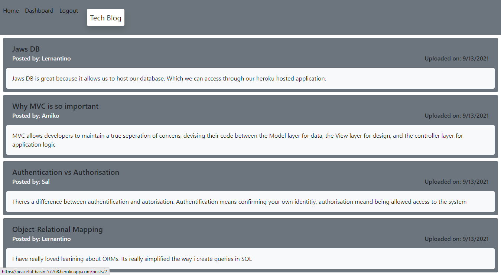

# Tech Blog  

## Description  
A simple blog were users can discuss current and upcoming web development technologies. Users can sign up and add, update and delete new posts, and other users can comment on these posts.   
  
## Table of Contents  
- [Installation](#installation)
- [Usage](#usage)
- [Credits](#credits)
- [Questions](#questions)
- [License](#license)

## Installation 
No need to install anything, you can use the application as it is hosted at https://peaceful-basin-57768.herokuapp.com/

## Technologies 
- Handlebars
- Sequelise
- Express
- Express-session
- bcrypt 

## Usage
[link to demonstration](https://drive.google.com/file/d/1EMoW1hc-s-rXs7XZ51HIP1reS-zMb-h7/view)

## Credits    
https://github.com/kevinjr1998    
  
## License 
This project is covered under the [MIT](https://opensource.org/licenses/MIT) license

## Tests    
No tests required

## Questions
https://github.com/kevinjr1998

For further questions, please contact me at please contact me at kevinryner@yahoo.co.uk     
